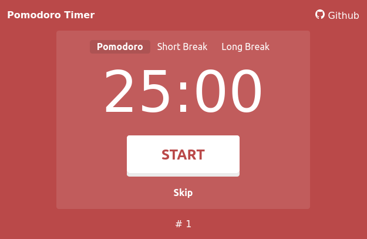

# 🍅⏲ Pomodoro Timer

A Pomodoro Technique timer website. My first JavaScript app project.

[You can try out the live demo here.](https://nightmono.github.io/pomodoro-timer/)

This project is very much a handmade-copy of [pomofocus.io](https://pomofocus.io/) using raw HTML/CSS and JavaScript. 

The app is currently really bare-bones because it only has the features that I use. Although I may implement more feature in the future

## Potential Features

- [ ] Tasks
- [ ] Custom timer times
- [ ] Custom ticking and alarm sound
- [ ] Notifications

As this app is serverless, implmenting features such as an API or mobile notifications will be outside my skillset. (I'm not entirely sure if it's possible.)
